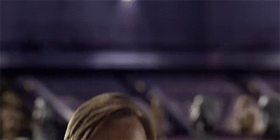

### Hello there! I'm Kev (@ecolology) and welcome to my GitHub!

🦘🌴 &nbsp;Post-doctoral Research Fellow at the University of Queensland (Meeanjin, Brisbane, Australia)

🧑🏽‍💻🐠 &nbsp;Population eco-evolutionary modelling, R statistics, and data analysis

♻️👩🏾‍🔬 &nbsp;Pushing for reproducible, reliable, open, transparent, equitable, and diverse science with [SORTEE](https://www.sortee.org/)

🧬🪸 &nbsp;Currently developing genetically-explicit models of coral evolution with [@CRiginos1](https://github.com/CRiginos1)

🇨🇦❄️ &nbsp;Canuck originally from Winnipeg, Manitoba

 

If you use my repos often, consider buying me a coffee! ☕

